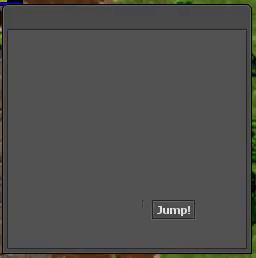

# Tavernlight Games Test
## Q1-Q2
### Q1 - Fix or improve the implementation of the below methods
```
local function releaseStorage(player)
    player:setStorageValue(1000, -1)
end

function onLogout(player)
    if player:getStorageValue(1000) == 1 then
        addEvent(releaseStorage, 1000, player)
    end
    return true
end

```

### Q2 - Fix or improve the implementation of the below method
```
function printSmallGuildNames(memberCount)
    -- this method is supposed to print names of all guilds that have less than memberCount max members
    local selectGuildQuery = "SELECT name FROM guilds WHERE max_members < %d;"
    local resultId = db.storeQuery(string.format(selectGuildQuery, memberCount))
    local guildName = result.getString("name")
    print(guildName)
end
```

### Q3 - Fix or improve the name and the implementation of the below method
```
function do_sth_with_PlayerParty(playerId, membername)
    player = Player(playerId)
    local party = player:getParty()

    for k,v in pairs(party:getMembers()) do
        if v == Player(membername) then
            party:removeMember(Player(membername))
        end
    end
end
```

### Q4 - Assume all method calls work fine. Fix the memory leak issue in below method
```
void Game::addItemToPlayer(const std::string& recipient, uint16_t itemId)
{
    Player* player = g_game.getPlayerByName(recipient);
    if (!player) {
        player = new Player(nullptr);
        if (!IOLoginData::loadPlayerByName(player, recipient)) {
            return;
        }
    }

    Item* item = Item::CreateItem(itemId);
    if (!item) {
        return;
    }

    g_game.internalAddItem(player->getInbox(), item, INDEX_WHEREEVER, FLAG_NOLIMIT);

    if (player->isOffline()) {
        IOLoginData::savePlayer(player);
    }
}
```
## Q5-Q7
### Q5 - Replicate


### Q6 - Replicate


### Q7 - Replicate


## Dependencies 
| Name                                             | Version | Licence                                                              |
|--------------------------------------------------|---------|----------------------------------------------------------------------|
| [TFS](https://github.com/otland/forgottenserver) | 1.4.2   | [GNU](https://github.com/otland/forgottenserver/blob/master/LICENSE) |
| [OTC](https://github.com/edubart/otclient)       | 0.6.6   | [MIT](https://github.com/edubart/otclient/blob/master/LICENSE)       |

